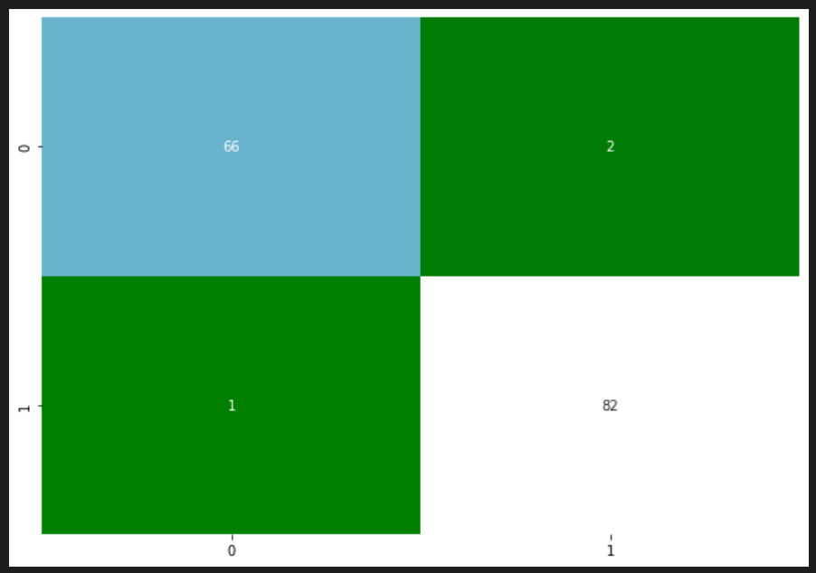

# Modèle pour la détection de masques (à partir d'images)

## Documents relatifs à ce projet
Pour ce projet, il est nécessaire de télécharger le dataset disponible à [l'adresse suivante](https://www.kaggle.com/omkargurav/face-mask-dataset).  
Dans ce repository, vous trouverez comme documents : 
- un jupyter notebook `masques.ipynb`
- le modèle sauvegardé : `modelmask`, avec comme sous-fichiers:
  - `saved_model.pb`
  - `keras_metadata.pb`
  - `variables.index`
  - `variables.data-00000-of-00001`
- plusieurs images de test trouvées sur Internet et dans le dataset:
  - `001.jpg`
  - `3.jpg`
  
## Jupyter Notebook
Le jupyter notebook comprend plusieurs étapes.  
Tout d'abord il y a l'importation des différentes bibliothèques que nous allons utiliser.  
Puis il y a le chargement des données où l'on récupère l'image et son label (*with_mask* et *without_mask*).  
Ensuite, on transforme ces données en array numpy.  
Puis on divise les images par 255.
Ensuite, on affiche des images aléatoires avec le label associé.  
Après, on sépare les données en *train*, *test*, *val*.
Ensuite, on utilise *LabelEncoder* sur les *y*.  
Après cela, grâce à *Keras*, on fait de la data augmentation pour élargir notre dataset en réutilisant les données déjà existantes et en les déformant.   
Ensuite, il y a le développement de l'architecture du modèle VGG16. 
Le développement de cette architecture se termine par la compilation du modèle et la visualisation de *l'accuracy*, de la *val-accuracy* et de la *loss* du modèle au cours de différentes *epochs*.  
Après cela, il y a une visualisation graphique de *l'accuracy* du modèle ainsi que la mise en place d'une matrice de confusion.  
    
Pour enregistrer ce modèle de CNN on utilise la fonction `model.save` de TensorFlow. Ici le modèle est enregistré sous le nom `modelmask`.  
Enfin, on teste notre modèle à partir d'une image qui n'est pas dans le dataset :

 

